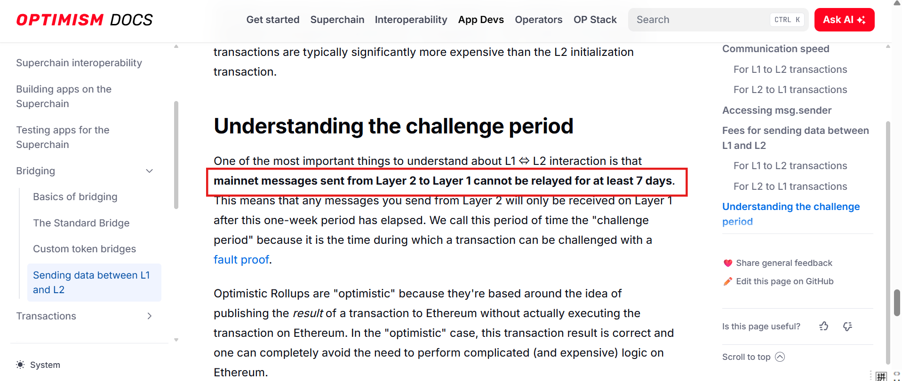
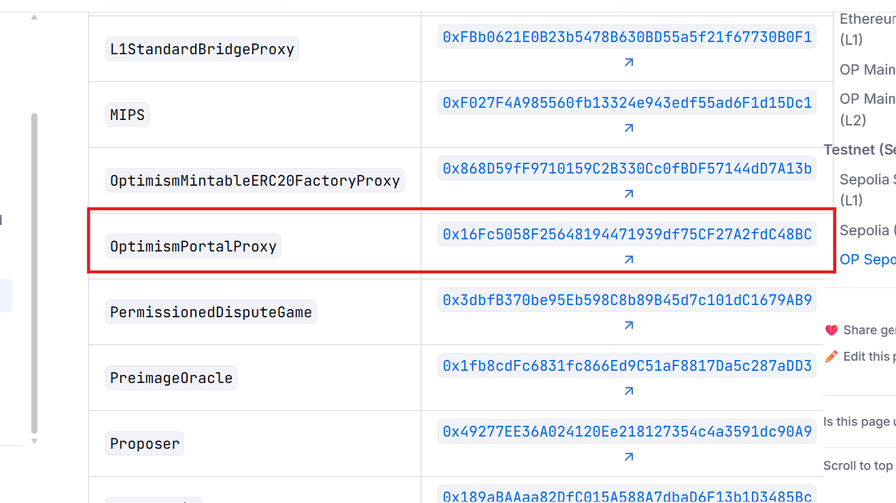

OP 测试网挑战期：7 天

通过官网文档查看

通过浏览器产看 L1 上的合约地址 检查变量的数值也可以

https://sepolia.etherscan.io/address/0x16Fc5058F25648194471939df75CF27A2fdC48BC#readProxyContract

或者通过 github 里的配置文件 或内部代码中查看
配置文件:optimism/packages/contracts-bedrock/deploy-config /mainnet.json
"finalizationPeriodSeconds": 604800,
